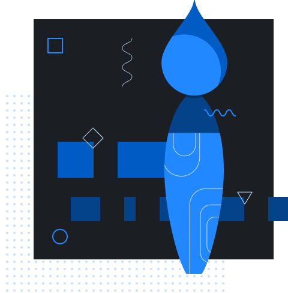

  

  <h3 align="center">Primer.style</h3>

  <a href="https://primer.style/components">Components</a>
  ·
  <a href="https://github.com/primer">Primer org</a>
  ·
  <a href="https://spectrum.chat/primer">Community</a>

Primer is GitHub's design system.  The <a href="https://primer.style/">primer.style</a> website will, over time, be the hub from which all Primer web properties are linked from.

---
  
#### Up-coming work & contributing
  
We're working on updating our websites, domains, and npm package names so that it will be easier in future to find all things Primer. We welcome feedback and contributions at any time. Please check existing issues and pull requests before contributing, and please communicate via an issue first if you intend to make large-scale changes. See [contributing](.github/CONTRIBUTING.md) for more info.

#### Team
- [@colebemis](https://github.com/colebemis)
- [@zainkho](https://github.com/zainkho)
- [@simurai](https://github.com/simurai)
- [@ashygee](https://github.com/ashygee)
- [@emilybrick](https://github.com/emilybrick)
- [@emplums](https://github.com/emplums)
- [@shawnbot](https://github.com/shawnbot)
- [@jonrohan](https://github.com/jonrohan)
- [@broccolini](https://github.com/broccolini)

#### Alumni
- [@jhuashao](https://github.com/jhuashao)
